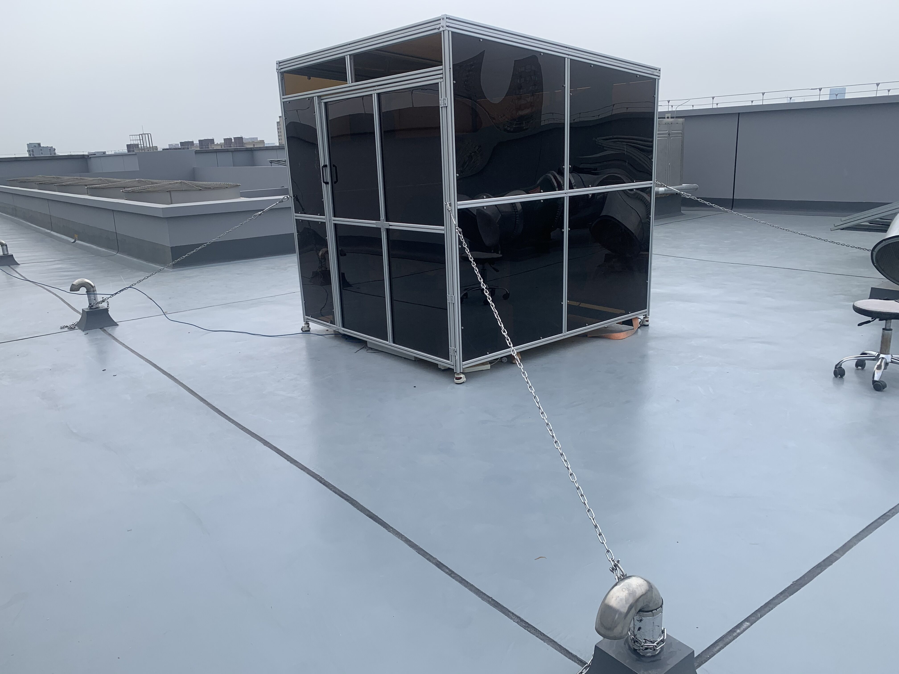
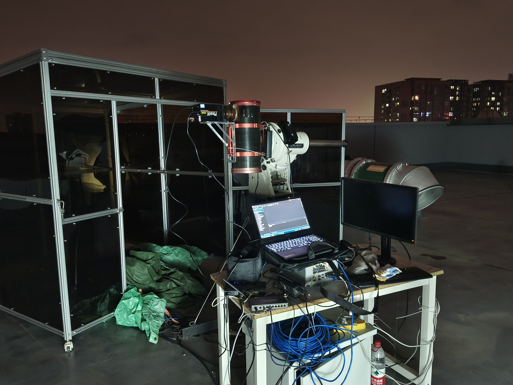
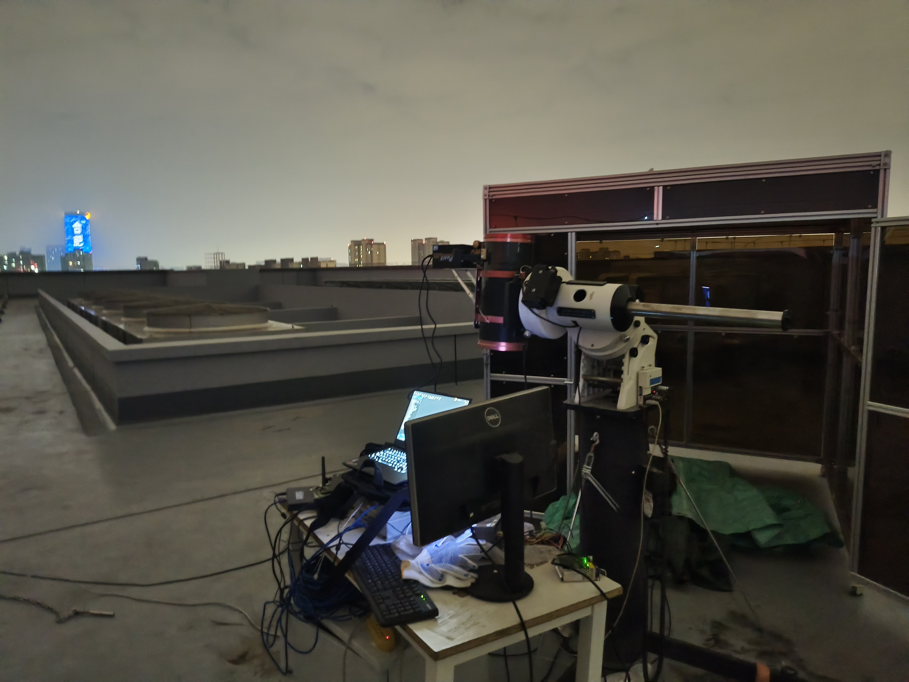

## OCS项目介绍 {#ocs_research_project}

OCS的全称为observation control system/ observatory control system，两个不同的称呼代表了其不同的阶段，前者被称为观测控制系统，后者被称为台站控制系统。

前者在一定程度上可以被视为后者的子集，观测控制系统主要起到对观测流的控制作用，仅关注与观测流程相关的内容，而台站控制系统则在观测流的基础上，同步叠加对于台站其他设备状态的控制与关注，例如加入了故障诊断系统、观测策略系统等。

### 实验室自建小型望远镜观测控制系统

这台望远镜位于实验室楼顶，整体设备来源于以前的实验室项目，项目拆除后相关望远镜设备被运了回来，实验室将相关设备借了过来，搭建了可供实验室同学学习与使用的小型望远镜，非常不幸的是，在转移与重建的过程中，小型望远镜的镜筒受到了损坏，仅有支架与赤道仪等可用，实验室因此额外采购了一个非原装的镜筒，该镜筒与原装镜筒相比之下功能确有不足，例如只能手动调焦等等。

但是对于刚进入实验室的同学来说，该望远镜不失为一个非常好的练手选项，望远镜整体由支架、赤道仪、镜筒、相机、防水布、工控机及其外设、亚克力小房子组成，其他的部分均比较常规，均与正常的望远镜中该部分的setting相同，这里着重讲一讲与其他望远镜不大一样的部分：

+ **相机**：一般来说自己组装的望远镜相机会采用固定的，但是由于此望远镜为本实验室自建望远镜，而本实验室的另一大业务为相机研发，因此本望远镜所采用的相机并不固定型号，一般情况下回直接使用实验室空置的相机。
+ **亚克力小房子**：在望远镜的一般实践中，望远镜均会配备圆顶，起到为望远镜遮风挡雨的作用，但是由于经费的问题，我们并没有为该小望远镜采购/修建圆顶，而是使用了亚克力板与对应的结构骨架修建了一座小房子，该小房子底部采用福马轮支撑，在进行观测时仅需松开福马轮即可推开，露出望远镜进行观测。
+ **防水布**：这也是这个望远镜的特殊处之一，在一般实践中，仅依靠圆顶即可完成风雨的遮挡，但是由于亚克力板与结构骨架连接处存在缝隙，仅依靠亚克力小房子无法完成风雨的遮蔽，因为我们采购了防水布，在观测完成后会将防水布覆于望远镜上，防止风雨导致望远镜损坏，一种更好的实践是将防水布覆于亚克力小房子上，但是由于未能在实验室中找到如此巨大的防水布，我们并未采用此类实践。

搭建望远镜如下图所示：

<!-- {width=300px} -->
**搭建完毕的望远镜以及为他遮风避雨的小房子**

观测时我们需要将望远镜从小房子中推出来，推出来后的情况如下图所示：

{width=300px}
推出来观测的望远镜图1

 

{width=300px}
推出来观测的望远镜图2

 

我们一般会使用实验室空置的相机装在望远镜上来进行观测，相机安装后图像如下所示：

{width=300px}
安装好的相机

### 用于空间碎片观测的观测控制系统

### WFST望远镜观测控制系统

## 相机项目介绍 {#camera_research_project}

### 相机测试平台项目

### 用于空间碎片观测的科学级相机研发

### 用于定位测量的CMOS相机研发

### 大靶面超高速率的sCMOS相机研发

### 顺手一块写了目前还不知道用于啥的sCMOS相机研发